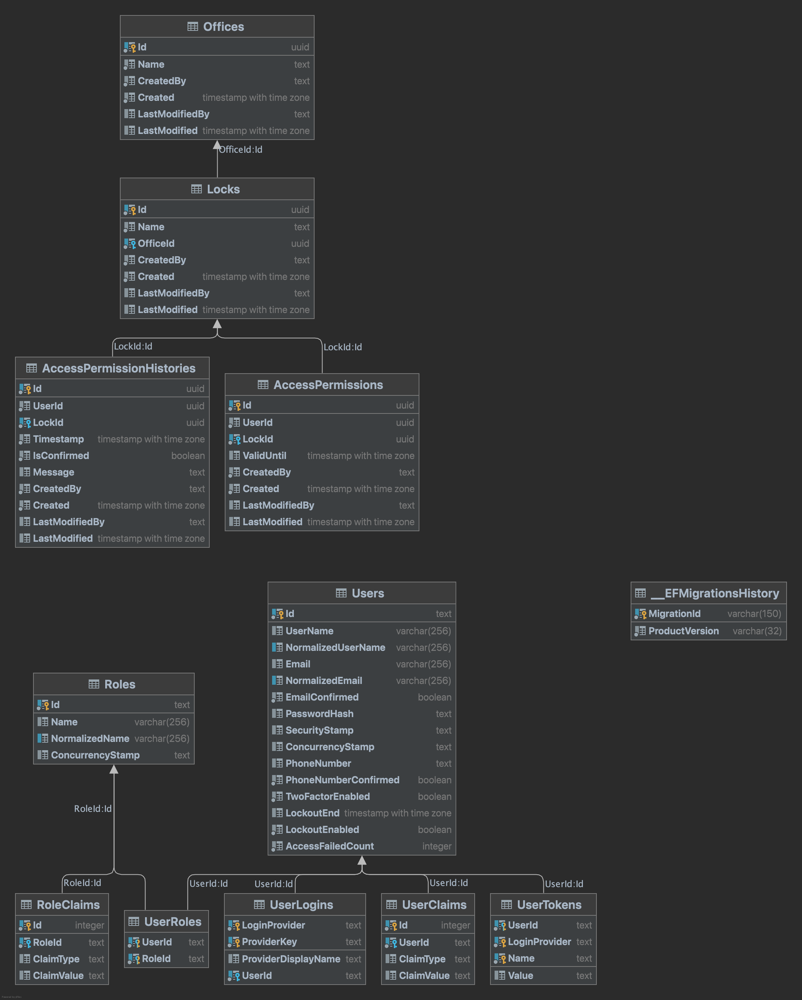

# dotnet-smart-lock-sample

Sample Dotnet Smart Lock Management Solution which mimics the access permissions and controls to digital locks remotely. The Applications tries to demonstrate how to give access permissions to users to be able to open locks at offices based on roles based authorization approach.

# Architecture and Database Design



# Technologies and Libraries

- ASP.NET Core Identity is used for built-in authentication and authorization. Microsoft removed the default support for Identity Server in .NET 8 and redesigned the internal architecture of ASP.NET Core Identity to be more suitable for SPAs and native apps. .NET 8 introduces a new set of Identity API endpoints and support for token-based authentication.
- The entire application is designed by using Onion architecture which consists of four different layers namely domain, infrastructure, application and presentation (webapi) layers to have clean architecture. This allows application to perform both pyhsical and logical separation of concerns.
- Default bearer token authentication is provided by Identity APIs and integrated with controllers.
- Postgres database used to be able to utilize and maintain relations between objects in the application design.
- Global error handling is added to manage all the errors in central place.
- Fluent validation is used to manage request validations smoothly.
- MediatR is used to separate command and queries each other which led application to scale flawlessly in the future.
- Swagger with token functionality is also provisioned for testing purposes.
- Api versioning is added.
- Moq, FluentAssertions, xUnit and Castle libraries are used for unit testing.

# Quick Start

- Please ensure that postgres is running somewhere to be able to access it through the application. Modify appsettings.Development.json for connection string and navigate to the SampleSmartLockApp.WebApi folder and then apply migrations by using this command. (Please note that dotnet-ef should be globally installed in local machine to run this command):

```
dotnet ef database update --project ../SampleSmartLockApp.Infrastructure
```

- To run the applications, following commands can be used under the SampleSmartLockApp.WebApi folder

```
dotnet run
dotnet watch
```

# Takeaways

- Users have roles such as Administrator, Director, OfficeManager, Employee and Manager.
- SeedInitializer inserts necessary roles and users for demonstration purposes when application is starting.
- Only Administrator role is allowed to control access permissions and user endpoints.

# Further Improvement Points and Missing Dots

- Some of the unit tests are added for visual and readiness but to be able to complete of testing all the business logic then missing unit tests should be added later on.
- Integration tests need to be added later to test the application starting from the controller side and check the cross-cutting concerns like authentication, authorization and validations.
- In some places, there are many round-trips to database to provide secure and safe business logic but the number of queries can be decreased by combining or initiating joins between tables to check multiple things at once.
- For the additional customization to Identity APIs, all the apis can be replaced with custom ones to provide all the built-in functionalities manually like authentication token creation and verification.
- Deployments through the CI-CD pipelines can be integrated based on platform and version management tool decision.
